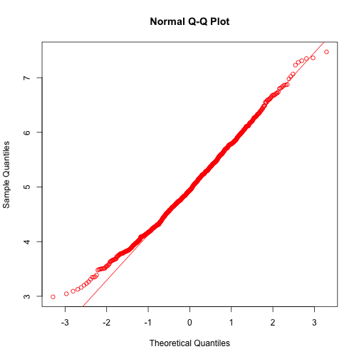

#Statistical Inference - Course Project  (Part-1)
***Shabir Jan***  
***Jan 22,2015***

#Synopsis
This is the project for the statistical inference class. In it, you will use simulation to explore inference and do some simple inferential data analysis. The Project contain two parts. 

        1. A Simulation Exercise.  
        2. Basic Inferential Data Analysis.
#1. Simulation  Exercise

##Simulations  
The exponential distribution can be simulated in R with `rexp(n,lambda)` where `lambda` is the rate parameter. The mean of exponential distribution is `1/lambda` and the standard devication is also `1/lambda`. Set lambda = 0.2 for all the simulations. In this simulation, you will investigate the distribution of averages of 40 exponenetial(0.2)s. (We will need to do 1000 or so simulated avergaes of 40 exponenetial).


```r
#set seeed
set.seed(3)
lambda <- 0.2

# we will perform 1000 simulations with 40 samples
sampleSize <- 40
simulations <- 1000

simulatedExpos <- matrix(rexp(simulations*sampleSize,rate=lambda),simulations,sampleSize)

#Average of 40 exponentials
means <- rowMeans(simulatedExpos)
```
##Simulation Results  
1. **Show where the distribution is centered and compare it to the therotical center of the distribution.**  


```r
mean(means)
```

```
## [1] 4.98662
```


```r
1/lambda
```

```
## [1] 5
```
The distribution of sample mean is shown in the following plot:

```r
hist(means, breaks=50, prob=TRUE,
     main="Exponential Function Simulations",
     xlab="", col="green")
# density of the averages of samples
lines(density(means), col="red")

# theoretical center of distribution
abline(v=1/lambda, col="blue")
# theoretical density of the averages of samples
xfit <- seq(min(means), max(means), length=100)
yfit <- dnorm(xfit, mean=1/lambda, sd=(1/lambda/sqrt(sampleSize)))
lines(xfit, yfit, pch=22, col="blue", lty=2)

# add legend
legend('topright', c("simulation", "theoretical"), lty=c(1,2), col=c("black", "blue"))
```

 

Therefore, the distribution of averages of 40 exponential is centered at 4.9866197 and the same is close to theoretical center of the distribution, which is 5.

2. **Show how variable it is and compare it to therotical variance of distribution.**


```r
# standard deviation of distribution of averages of 40 exponentials.
sd(means)
```

```
## [1] 0.7910484
```

```r
#standard deviation of analytical expression.
(1/lambda)/sqrt(sampleSize)
```

```
## [1] 0.7905694
```

```r
#Variance of sample mean
var(means)
```

```
## [1] 0.6257575
```

```r
#Theoritical variance of the distrubtion
1/((0.2*0.2)*40)
```

```
## [1] 0.625
```

Therefore , the variablity in distribution of averages of 40 exponentials is close to the theroretical variance of the distribution.

The variance of sample means is 0.6257575 where as the theroretical variance of the distribution is  $\sigma^2 / n = 1/(\lambda^2 n) = 1/(0.04 \times 40)$ = 0.625.

3.**Show that the distribution is approximately normal.**


```r
qqnorm(means,col="red")
qqline(means,col=2)
```

 

Due to the central limit theorem, the averages of samples follow normal distribution. The figure above also shows the density computed using the histogram and the normal density plotted with theoretical mean and variance values. Also, the q-q plot suggests the distribution of averages of 40 exponentials is very close to a normal distribution.

