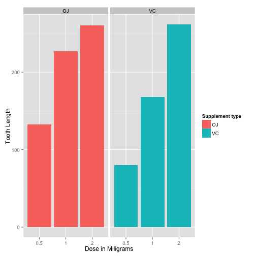
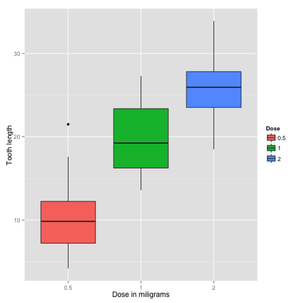
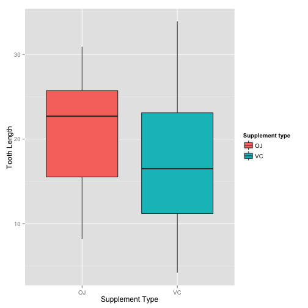

#Statistical Inference - Course Project  (Part-2)
***Shabir Jan***  
***Jan 22,2015***


#2. Basic Inferential Data Analysis

##1. Load the ToothGrowth data and perform some basic exploratory data analyses.


```r
#load the dataset
library(datasets)
data <- ToothGrowth

#look at the data
head(data,2)
```

```
##    len supp dose
## 1  4.2   VC  0.5
## 2 11.5   VC  0.5
```

```r
str(data)
```

```
## 'data.frame':	60 obs. of  3 variables:
##  $ len : num  4.2 11.5 7.3 5.8 6.4 10 11.2 11.2 5.2 7 ...
##  $ supp: Factor w/ 2 levels "OJ","VC": 2 2 2 2 2 2 2 2 2 2 ...
##  $ dose: num  0.5 0.5 0.5 0.5 0.5 0.5 0.5 0.5 0.5 0.5 ...
```

```r
#convert variable dose to factor from numeric
data$dose <- as.factor(data$dose)

#number of rows and columns in dataset
dim(data)
```

```
## [1] 60  3
```

##2. Provide basic summary of data.


```r
library(ggplot2)

ggplot(data=data, aes(x=dose, y=len, fill=supp)) +
    geom_bar(stat="identity",) +
    facet_grid(. ~ supp) +
    xlab("Dose in Miligrams") +
    ylab("Tooth Length") +
    guides(fill=guide_legend(title="Supplement type"))
```

 


```r
ggplot(aes(x=dose, y=len), data=data) + geom_boxplot(aes(fill=dose)) + xlab("Dose in miligrams") + ylab("Tooth length") + guides(fill=guide_legend(title="Dose"))
```

 


```r
ggplot(aes(x=supp, y=len), data=data) + geom_boxplot(aes(fill=supp)) + xlab("Supplement Type") + ylab("Tooth Length") + guides(fill=guide_legend(title="Supplement type"))
```

 

Basic Summary 

```r
summary(data)
```

```
##       len        supp     dose   
##  Min.   : 4.20   OJ:30   0.5:20  
##  1st Qu.:13.07   VC:30   1  :20  
##  Median :19.25           2  :20  
##  Mean   :18.81                   
##  3rd Qu.:25.27                   
##  Max.   :33.90
```

##3.Use confidence intervals and hypothesis tests to compare tooth growth by supp and dose.


```r
t.test(len~supp,data=data)
```

```
## 
## 	Welch Two Sample t-test
## 
## data:  len by supp
## t = 1.9153, df = 55.309, p-value = 0.06063
## alternative hypothesis: true difference in means is not equal to 0
## 95 percent confidence interval:
##  -0.1710156  7.5710156
## sample estimates:
## mean in group OJ mean in group VC 
##         20.66333         16.96333
```
Null hypothesis can not be rejected as confindence intervals contain zero and p-value is 0.06.

Supplement types seems to have no impact on Tooth growth.


```r
# three groups per dose level
doses_0.5_1.0 <- subset(data,dose %in% c(0.5,1.0))
doses_0.5_2.0 <- subset(data,dose %in% c(0.5,2.0))
doses_1.0_2.0 <- subset(data,dose %in% c(1.0,2.0))

#check for dose level(0.5,1.0)
t.test(len~dose, data=doses_0.5_1.0)
```

```
## 
## 	Welch Two Sample t-test
## 
## data:  len by dose
## t = -6.4766, df = 37.986, p-value = 1.268e-07
## alternative hypothesis: true difference in means is not equal to 0
## 95 percent confidence interval:
##  -11.983781  -6.276219
## sample estimates:
## mean in group 0.5   mean in group 1 
##            10.605            19.735
```

```r
#check for dose level(0.5,2.0)
t.test(len~dose, data=doses_0.5_2.0)
```

```
## 
## 	Welch Two Sample t-test
## 
## data:  len by dose
## t = -11.799, df = 36.883, p-value = 4.398e-14
## alternative hypothesis: true difference in means is not equal to 0
## 95 percent confidence interval:
##  -18.15617 -12.83383
## sample estimates:
## mean in group 0.5   mean in group 2 
##            10.605            26.100
```

```r
#check for dose level(1.0,2.0)
t.test(len~dose, data=doses_1.0_2.0)
```

```
## 
## 	Welch Two Sample t-test
## 
## data:  len by dose
## t = -4.9005, df = 37.101, p-value = 1.906e-05
## alternative hypothesis: true difference in means is not equal to 0
## 95 percent confidence interval:
##  -8.996481 -3.733519
## sample estimates:
## mean in group 1 mean in group 2 
##          19.735          26.100
```
So these shows that the p-value is less than 0.05 and confindence intervals dont contain 0. The average tooth length increases with an increasing dose. The null hypothesis can be rejected.

##4. State your conclusions and assumptions need for your conclusions.

Conclusions

1. Supplement type seem to have no impact on tooth growth.
2. Inreasing the dose level leads to increased tooth growth as well.

Assumptions

1. The experiment was done with random assignment of guinea pigs to different dose level categories and supplement type to control for confounders that might affect the outcome.

2. Members of the sample population, i.e. the 60 guinea pigs, are representative of the entire population of guinea pigs. This assumption allows us to generalize the results.

3. For the t-tests, the variances are assumed to be different for the two groups being compared. This assumption is less stronger than the case in which the variances are assumed to be equal.
